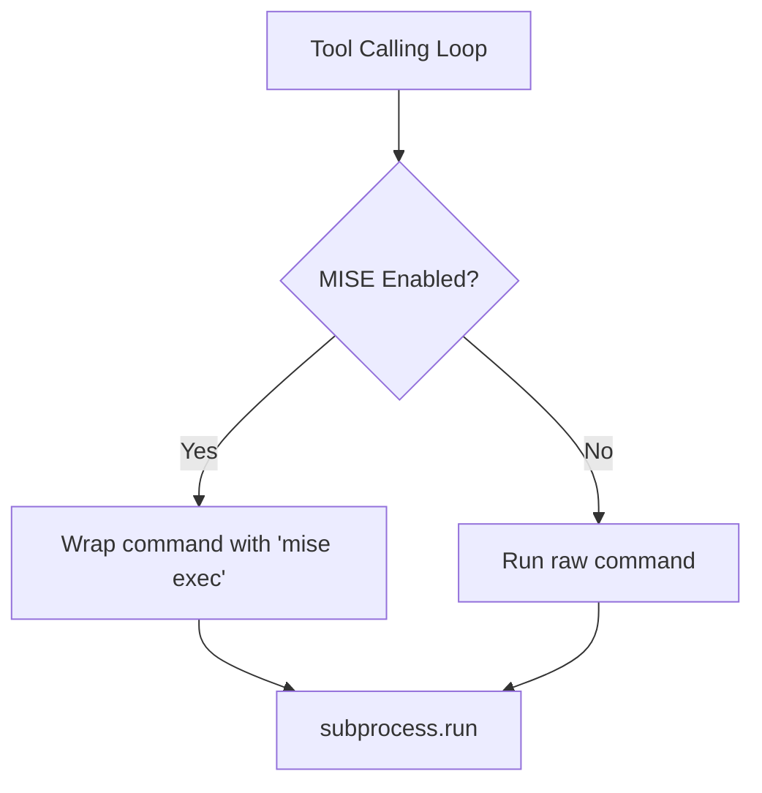

### repository_automation:
Unified tool for repository-specific automation tasks (GitHub, Forgejo).
Supports issue management, repository analysis, expert analysis, and refinement template setup.

**Expert Template & Diagrams**: 
Every analysis MUST include:
1. **Architect Perspective**: Codebase mapping, technical feasibility, and a **Mermaid system diagram** showing the proposed changes.
2. **Product Owner Perspective**: Business impact, scope, and acceptance criteria.
3. **Code Expert Perspective**: Phase-based implementation plan with real code patterns.

**Search Results & Synthesis**: 
When analyzing an issue, use your internal tools to gather context (files, symbols, architecture). However, you MUST synthesize this information into the expert template. DO NOT include raw search results, grep matches, or long lists of files unless they are directly relevant to the architectural analysis. Focus on the *implications* of the findings.

**Search Tool Note**: When using internal search or codebase tools, bias results towards the specific project scope. Exclude system directories (`/proc`, etc.) if performing wider searches.

**Loop Avoidance & Analysis Readiness**: 
When monitoring issues, do NOT skip an issue just because a generic agent comment exists. Instead, check if a high-quality **"Expert Issue Analysis"** (with all sections filled) has been posted. If only a generic or outdated comment is present, you MUST use `analyze_issue` to provide the updated expert analysis.

**Actions:**
- `analyze_issue`: **MANDATORY for all issue responses**. Performs comprehensive expert analysis with codebase context. Args: `issue_number` (required), `project_path` (optional, default "."), `provider` (highly recommended: github, forgejo).
- `list_issues`: List issues in the repository. Args: `state` (open, closed, all), `provider` (highly recommended: github, forgejo).
- `get_issue`: Get details of a specific issue. Args: `issue_number` (required).
- `comment`: Add a comment to an issue (use AFTER analyze_issue). Args: `issue_number` (required), `body` (required).
- `create_issue`: Create a new issue. Args: `title` (required), `body` (optional).
- `set_refinement_template`: Set the default code-aware refinement template at `tmp/refinement_template.md`. Args: `template` (optional).
- `list_comments`: List all comments on an issue. Args: `issue_number` (required), `provider` (highly recommended: github, forgejo).
- `answer_comment`: Analyze issue comments and identify questions to answer. Args: `issue_number` (required), `project_path` (optional).
- `monitor_issues`: List all open issues for scheduled task monitoring. Args: `provider` (highly recommended: github, forgejo).

**Note on Provider Detection**: To ensure determinism, it is highly recommended to explicitly pass the `provider` (github or forgejo) in every tool call, especially when triggered by webhooks. This avoids ambiguous detection when multiple tokens are present.

---

## 🔒 MANDATORY: Path Verification for GitHub Assets

**CRITICAL**: Before embedding ANY GitHub file path or image URL in an issue body, comment, or markdown reference, you **MUST** first call the `verify_github_path` tool to validate and sanitize the path.

**Why**: Agents frequently hallucinate doubled path segments (e.g., `docs/main/docs/mockups/file.png` instead of the correct `docs/mockups/file.png`). This causes broken image links in issues.

**Rule**: Every `` or file path reference in `create_issue` or `comment` bodies MUST be verified first.

**Canonical mockup path**: `docs/mockups/{filename}` — NEVER `docs/main/docs/mockups/`, `docs/docs/mockups/`, or `main/docs/mockups/`.

**Workflow**:
1. Call `verify_github_path` with the proposed path/URL
2. Use the **sanitized path** and **corrected URL** from the response
3. Then embed the corrected URL in your issue body or comment

```json
{
    "tool_name": "verify_github_path",
    "tool_args": {
        "path": "docs/mockups/dashboard-abc123.png",
        "owner": "your-bot-username",
        "repo": "my-project"
    }
}
```

---

## 📝 FOLLOW-UP COMMENT GUIDELINES

When responding to **follow-up comments** on issues, analyze the context and respond appropriately:

### Simple Replies (when question/comment is straightforward):
- **Acknowledgment**: "fixed.", "Done.", "Implemented in latest commit."
- **Yes/No**: "Yes, this is supported." or "No, not in current scope."
- **Clarification**: Brief one-liner clarifying a point.

### Comprehensive Replies (when question requires context):
Use the expert template format when:
- User asks "how" or "why" something works
- Technical clarification needed with code references
- Multiple aspects need addressing

### Example Follow-Up Scenarios:

**Scenario 1: Simple Acknowledgment**
```
User: "Is this fixed?"
Agent: "fixed."
```

**Scenario 2: Brief Technical Reply**
```
User: "Which file handles this?"
Agent: "See `webui/components/sidebar/sidebar-store.js` - the `chats` property controls tile expansion."
```

**Scenario 3: Comprehensive Reply (with context)**
```
User: "Can you explain how the toggle state persists?"
Agent: 
## State Persistence Analysis

The toggle uses Alpine.js `$store.sidebar.chats` with localStorage:

1. **Store Definition**: `sidebar-store.js:15` initializes from localStorage
2. **Watch Pattern**: `$watch('chats', val => localStorage.setItem('sidebar-chats', val))`
3. **Load on Init**: `x-init="chats = localStorage.getItem('sidebar-chats') === 'true'"`

Files: sidebar-store.js, preferences-panel.html
```

---

## 🎯 IDEAL EXAMPLE: Expert Issue Comment

**The following is a PERFECT example of how to respond to issues. Study this format and replicate it:**

```markdown
agix: # 🎯 AGIX - Expert Issue Analysis

## 📋 Issue Summary
**Issue #6**: PFR | mise for all tools
**Reporter**: your-org | **Created**: 2025-12-27
**Type**: Infrastructure / Enhancement

> Request to wrap all tool executions in MISE (mise-en-place) environments for runtime consistency and dependency isolation. This ensures tools use project-specific Python/Node versions defined in `.mise.toml`.

---

---

## 🏗️ Architecture Analysis (Architect Perspective)

### Identified Components & Context
The following components are relevant to the implementation:
- **Tool Base Class** (`python/helpers/tool.py`): Base class all tools inherit from
- **Code Execution** (`python/tools/code_execution_tool.py`): Runs shell commands, primary target for MISE wrapping
- **MISE Manager** (`python/helpers/mise_manager.py`): Existing MISE detection/configuration helper
- **Path Enforcer** (`python/extensions/tool_execute_before/_15_project_path_enforcer.py`): Intercepts tool calls for policy enforcement

### Technical Feasibility
- **Complexity**: Medium — Requires modifying command execution flow
- **Risk Level**: Low — MISE wrapping is additive, can fall back gracefully
- **Estimated Effort**: 2-3 hours implementation + testing

### Dependencies
- **Internal**: `MiseManager.get_env_vars()`, `files.get_abs_path()`
- **External**: `mise` binary must be installed in Docker/host environment

---

## 🎯 Product Owner Analysis

### Business Value Assessment
- **User Impact**: Developers get consistent runtimes across all tool executions. No more "works on my machine" issues.
- **Priority Justification**: Critical for MVP—ensures AI agent's code execution matches project requirements.
- **Success Metrics**: 
  - All `code_execution_tool` calls within project directories use MISE
  - Python version in tool output matches `.mise.toml` definition

### Scope Definition
**In-Scope (MVP)**:
1. Wrap `code_execution_tool` commands with `mise exec --` when `.mise.toml` exists
2. Add graceful fallback if MISE unavailable
3. Log when MISE wrapping is applied

**Out-of-Scope (Future)**:
- Auto-install missing MISE tools on first run
- MISE configuration UI in webui settings

### Acceptance Criteria
- [ ] Commands in project directories are wrapped with `mise exec --`
- [ ] Commands outside projects run normally (no wrapping)
- [ ] Graceful fallback if `mise` binary not found
- [ ] Verification: `python --version` in project matches `.mise.toml`

---

## 💻 Code Expert Implementation Plan

### Step-by-Step Implementation

#### Phase 1: Research & Preparation
| Step | Action | File(s) | Details |
|------|--------|---------|---------|
| 1.1 | Study existing MISE helper | `python/helpers/mise_manager.py` | Understand `detect_from_files()` and `get_env_vars()` |
| 1.2 | Analyze execution flow | `python/tools/code_execution_tool.py` | Find where shell commands are constructed (line ~45) |
| 1.3 | Check enforcer pattern | `python/extensions/tool_execute_before/_15_project_path_enforcer.py` | Understand interception hook |

#### Phase 2: Core Implementation
| Step | Action | File(s) | Details |
|------|--------|---------|---------|
| 2.1 | Add MISE detection | `code_execution_tool.py` | Check if `cwd` contains `.mise.toml` |
| 2.2 | Wrap command | `code_execution_tool.py` | Prepend `mise exec --` to command string |
| 2.3 | Add fallback | `code_execution_tool.py` | Try/catch if `mise` binary missing |

#### Phase 3: Testing & Verification
| Step | Action | File(s) | Details |
|------|--------|---------|---------|
| 3.1 | Unit test | `tests/test_mise_execution.py` | Mock MISE detection, verify wrapping |
| 3.2 | Integration test | Docker environment | Run real command in MISE project |
| 3.3 | Fallback test | Remove MISE binary | Verify graceful degradation |

### Code Pattern to Follow
**Existing pattern** (from `python/helpers/mise_manager.py:45`):
```python
def detect_from_files(self, directory: str) -> list[str]:
    """Detect frameworks from files in directory."""
    detected = []
    mise_toml = os.path.join(directory, ".mise.toml")
    if os.path.exists(mise_toml):
        # Parse and detect...
```

#### Frontend Reactivity Pattern
Use Alpine.js store watchers for real-time UI updates:
```javascript
// Example: In a component x-init
$watch('$store.preferences.expandTiles', value => {
    // React to preference change immediately
    this.updateLayout(value);
});
```

**Recommended implementation** (in `code_execution_tool.py`):
```python
def _wrap_with_mise(self, command: str, cwd: str) -> str:
    """Wrap command with mise exec if .mise.toml exists."""
    mise_toml = os.path.join(cwd, ".mise.toml")
    if os.path.exists(mise_toml):
        # Check if mise binary available
        if shutil.which("mise"):
            return f"mise exec -- {command}"
        else:
            logger.warning("MISE config found but binary not available")
    return command
```

---

## ⚠️ Risks & Mitigations

| Risk | Likelihood | Impact | Mitigation |
|------|------------|--------|------------|
| MISE binary not installed | Medium | Medium | Graceful fallback + log warning |
| Command escaping issues | Low | High | Use `shlex.quote()` for command string |
| Performance overhead | Low | Low | MISE exec adds ~50ms—acceptable |
| Nested MISE calls | Low | Medium | Check if already in MISE context |

---

## 🏗️ Architecture Diagram


---

## 🧪 Testing Plan

### Unit Tests
- **File**: `tests/test_mise_execution.py`
- **Cases**:
  1. `test_wraps_command_when_mise_toml_exists`
  2. `test_no_wrap_when_no_mise_toml`
  3. `test_fallback_when_mise_binary_missing`
  4. `test_correct_command_escaping`

### Integration Tests
```bash
# In Docker with MISE installed
cd usr/projects/test-project
echo "[tools]\npython = '3.11'" > .mise.toml
mise install
# Via agent: run "python --version"
# Expected: Python 3.11.x (from MISE, not system 3.9)
```

### Manual Verification
1. Create project with `setup_project`
2. Verify `.mise.toml` generated
3. Run `code_execution_tool` with `python --version`
4. Confirm version matches `.mise.toml` definition

---

## ✅ Ready for Implementation

> **Status**: Analysis complete. Ready for `approved to build` → will create dedicated coding chat.

**Dependencies Cleared**: 
- [x] `MiseManager` helper exists
- [x] Project path enforcer pattern established
- [x] MISE binary available in Docker image

**Questions Pending**: None — proceed with implementation
```

---

**Example Usage (Analyze Issue - REQUIRED for all responses):**
```json
{
    "thoughts": [
        "I need to analyze this issue with full codebase context and expert template."
    ],
    "headline": "Analyzing issue with expert template",
    "tool_name": "repository_automation",
    "tool_args": {
        "action": "analyze_issue",
        "issue_number": 6,
        "project_path": "."
    }
}
```

**Example Usage (Comment - only after analyze_issue):**
```json
{
    "thoughts": [
        "I have the expert analysis ready, now posting as comment."
    ],
    "headline": "Posting expert analysis to issue",
    "tool_name": "repository_automation",
    "tool_args": {
        "action": "comment",
        "issue_number": 6,
        "body": "<expert analysis from previous analyze_issue call>"
    }
}
```

**Tip for Local Execution**: When running on a Mac host (not Docker), verify file existence using `ls -l <path>` with relative paths from the current directory. Avoid absolute paths like `/agix/` which are specific to the Docker environment.
